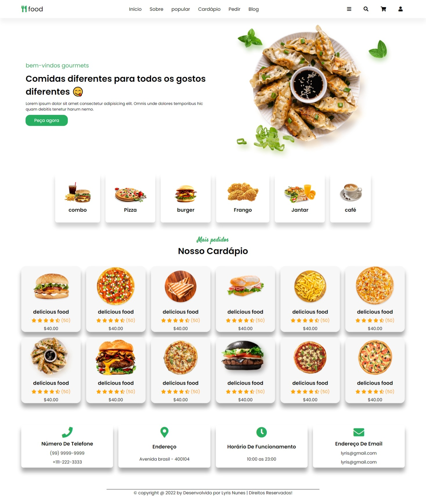

<h1>
    
</h1>

## 👩🏽‍💻 Sobre o Projeto Ifood

Site fictício

No projeto Ifood eu trabalhoi no desenvolvimento completo do HTML, CSS, FIGMA do site. Utilizei todo meu conhecimento inicial de HTML e CSS.

Este projeto é pessoal e não foi desenvolvido no curso.

Este projeto é responsivo, adaptavel a qualquer tamanho de tela.

## 👩🏽‍💻 Tecnologia Utilizada

O projeto foi desenvolvido com as seguintes tecnologias

- HTML

- CSS

## 👩🏽‍💻 Acesse o projeto

 <h3>
        <a href="https://lyrisnunes.github.io/site-pizzaria/"> - Veja o projeto clique aqui </a>
</h3>